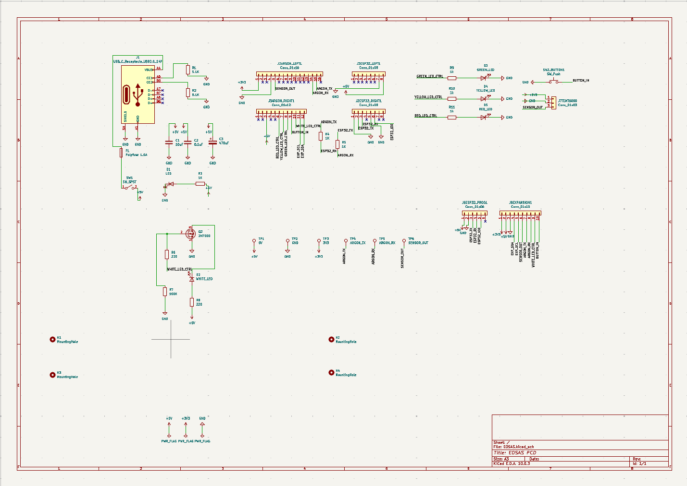
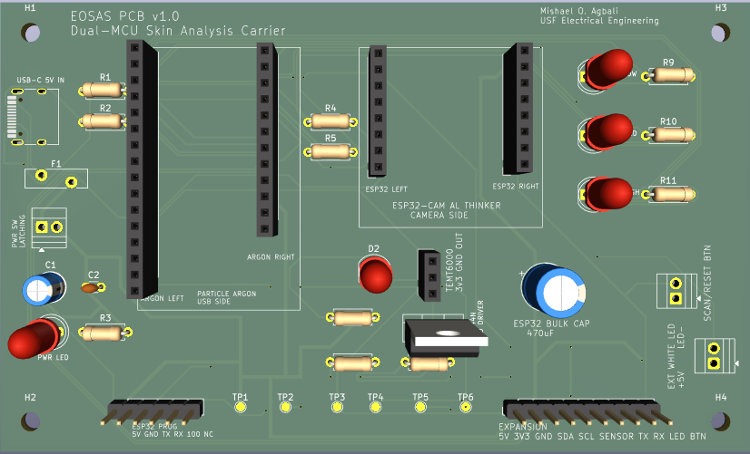

# EOSAS PCB v1.0

EOSAS PCB v1.0 is a custom dual-MCU carrier board designed to replace the breadboard wiring used in the original EOSAS prototype and consolidate the system electronics onto a dedicated PCB.

## Current Status

**Design complete — fabrication and physical validation pending.**

- Schematic completed
- PCB routing completed
- ERC passed
- DRC passed
- Ground plane completed
- Silkscreen and module outlines added
- 3D board layout reviewed

## PCB Features

- Particle Argon and ESP32-CAM integration
- USB-C 5 V power input
- Input fuse and power control
- Power status indicator
- TEMT6000 optical sensor interface
- MOSFET-controlled white scan illumination
- Low / Medium / High hazard indicator LEDs
- Separate power and scan controls
- ESP32 programming header
- Expansion interface
- External illumination connector
- Debug test points
- ESP32-CAM bulk capacitance for power stability
- Four mounting points for enclosure integration

## Design

### Schematic

### PCB Layout

### 3D Render

## Architecture

The Particle Argon serves as the primary hardware controller, managing user inputs, illumination, optical sensing, and hazard indicators. The ESP32-CAM handles image acquisition and communication with the EOSAS inference server.

The two controllers communicate through the PCB's dedicated interface, allowing the embedded hardware and image-processing pipeline to operate as one system.

## Next Steps

- Complete final pre-fabrication review
- Generate manufacturing files
- Fabricate PCB v1.0
- Assemble and perform board bring-up
- Validate power rails and interfaces
- Test Argon-to-ESP32 communication
- Calibrate optical sensing and scan illumination
- Integrate PCB into the final EOSAS enclosure
- Complete full system validation

> EOSAS is an experimental engineering project and is not intended to provide medical diagnoses.
