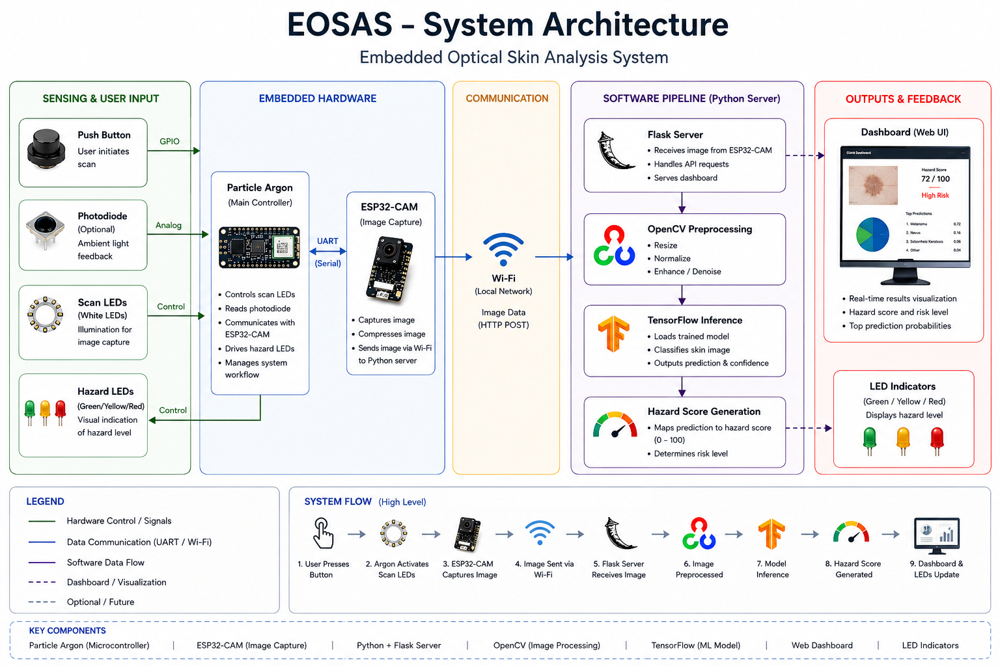

# EOSAS - Embedded Optical Skin Analysis System

EOSAS is a prototype embedded system developed to explore the integration of computer vision, machine learning, and embedded hardware. The system captures images using an ESP32-CAM, processes them through a Python-based machine learning pipeline, and generates a hazard score through a custom dashboard interface.

## Overview

EOSAS captures skin images using an ESP32-CAM, processes them through a machine learning pipeline, and displays results through a custom Flask dashboard. A Particle Argon controls the user interface, including scan lighting, button controls, and hazard indication LEDs.

*Figure 1. High-level EOSAS system architecture showing embedded hardware, communication, machine learning pipeline, and dashboard outputs.*

## 🎥 Demo Video

A demonstration of the current EOSAS prototype can be found in the `demo` folder:

➡️ **eosas_demo.mov**

If GitHub does not preview the video directly, download the file to view the full demonstration.

## Prototype Status

Current Features

- ESP32-CAM image capture
- Hazard scoring pipeline
- Dashboard interface
- LED status indicators
- Embedded control system

In Progress

- Photodiode integration
- Custom PCB
- Custom enclosure
- Improved model performance

## Features

* ESP32-CAM image capture
* Machine learning image classification
* Flask-based AI server
* Real-time dashboard visualization
* Particle Argon hardware controller
* White illumination LEDs
* Hazard indication LEDs (Green / Yellow / Red)
* Wi-Fi setup portal
* SD card image logging
* Portable multi-network deployment

## Hardware

- ESP32-CAM
- Particle Argon
- White illumination LEDs
- Status LEDs
- Push button
- SD card storage
- External power supply

## Software

* Python
* Flask
* TensorFlow / Keras
* OpenCV
* C++
* Arduino Framework
* Particle Device OS

## System Workflow

1. User initiates scan
2. Particle Argon activates lighting
3. ESP32-CAM captures image
4. Image is sent to Python server
5. OpenCV preprocesses image
6. TensorFlow model generates prediction
7. Dashboard displays results
8. Hazard indication LEDs update

## Engineering Challenges

During development, several challenges were encountered:

- Integrating embedded hardware with a machine learning workflow
- Managing image acquisition and transfer between devices
- Training and evaluating image classification models
- Designing a user interface for displaying results
- Coordinating communication between hardware and software subsystems

## Future Improvements

* Photodiode integration
* Custom PCB
* Custom enclosure
* Battery-powered operation
* Improved hazard scoring
* Automatic server discovery

## Author

Mishael Agbali

Electrical Engineering Student
University of South Florida

LinkedIn:
https://www.linkedin.com/in/mishael-agbali/

GitHub:
https://github.com/XcapeCodes
